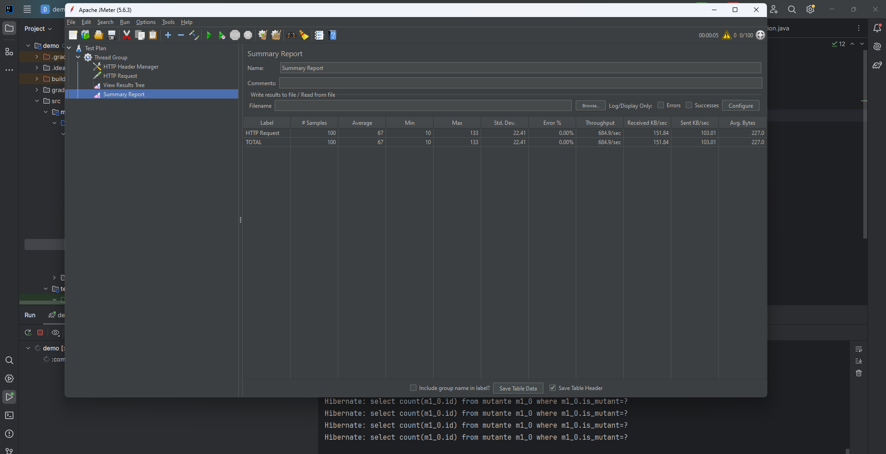

# API REST – Detección de ADN Mutante (Proyecto Académico)

Proyecto académico desarrollado para una evaluación de **BackEnd** en la carrera Ingeniería en Sistemas (UTN FRM).

Este repositorio se publica con fines de **portfolio personal**, con el objetivo de mostrar el desarrollo de una API REST en Java utilizando Spring Boot, incluyendo lógica de negocio, persistencia, documentación y despliegue.

---

## Descripción

La aplicación consiste en una **API REST** que analiza secuencias de ADN para determinar si corresponden a un **mutante** o a un **humano**.

Además, expone estadísticas agregadas sobre los análisis realizados, incluyendo:
- cantidad de ADN mutantes,
- cantidad de ADN humanos,
- ratio entre ambos.

La API fue diseñada para ejecutarse tanto en entorno local como en producción, y cuenta con documentación interactiva mediante Swagger.

---

### Endpoints principales:

- **POST /mutant**: Recibe una secuencia de ADN y determina si pertenece a un mutante.
  https://parcialbackend-desarrollo.onrender.com/mutant

- **GET /stats**: Retorna estadísticas sobre los ADN procesados (cantidad de mutantes, humanos y ratio).
  https://parcialbackend-desarrollo.onrender.com/stats

## Dependencias

A continuación, las dependencias utilizadas para el desarrollo del proyecto:

- *Spring Boot*: Framework para la creación de aplicaciones Java con mínima configuración.
- *Lombok*: Biblioteca que simplifica la creación de clases Java mediante anotaciones.
- *Spring Web*: Módulo de Spring que facilita la creación de aplicaciones web.
- *H2 Database*: Base de datos en memoria utilizada para almacenar temporalmente las secuencias de ADN analizadas.
- *Spring Data JPA*: Abstracción para el acceso a bases de datos relacionales utilizando JPA y Hibernate.
- *Spring Boot Dev Tools*: Herramienta que permite recarga automática de la aplicación durante el desarrollo.


## Requisitos Previos
Para ejecutar el proyecto de forma local, asegúrate de cumplir con los siguientes requisitos:

- Java 17 o superior.
- Maven o Gradle (dependiendo del gestor de dependencias utilizado).
- IDE compatible con Spring Boot como IntelliJ IDEA, Eclipse o VSCode.
- Postman o cualquier otra herramienta para probar APIs REST, o acceder a Swagger UI desde el navegador.
---
## Funcionamiento
### Análisis de ADN Mutante:
1. El endpoint `/mutant` acepta peticiones POST con un cuerpo JSON que incluye una secuencia de ADN en forma de un arreglo de cadenas.
2. El servicio de ADN valida si la secuencia ya ha sido analizada previamente en la base de datos. Si ya existe, se retorna el resultado almacenado.
3. Si es una nueva secuencia, se analizan las letras del ADN para identificar si existen dos o más secuencias de cuatro caracteres consecutivos iguales en las direcciones horizontal, vertical o diagonal.
4. Si se detecta que la secuencia es de un mutante, se devuelve un código **200 (OK)**. Si no, un código **403 (FORBIDDEN)**.

### Ejemplo de petición POST:
```json
{
    "dna": [
        "ATCGTA",
        "CGATGC",
        "GCTAGT",
        "TGCACT",
        "ACGTCA",
        "CGTACG"
    ]
}
```
### Estadísticas de ADN:
1. El endpoint `/stats ` ofrece un resumen con el número de ADN de mutantes y humanos analizados, además de calcular el ratio entre ambos.
2. El ratio se calcula como el cociente entre la cantidad de mutantes y la cantidad de humanos. Si no hay humanos, el ratio es 0.
### Ejemplo de petición POST:
```json
{
  "count_mutant_dna": 40,
  "count_human_dna": 100,
  "ratio": 0.4
}
```
## Lógica Implementada
### MutanteService:
- El método `analizarDna` es el responsable de verificar si una secuencia de ADN es de un mutante. Utiliza el repositorio para buscar si la secuencia ya ha sido evaluada previamente. Si no lo ha sido, utiliza el método `esMutante` para realizar el análisis.
- El método `esMutante` busca secuencias repetidas de cuatro letras en las direcciones horizontal, vertical y diagonal. Si se encuentran dos o más secuencias, el ADN es considerado de un mutante.
- El método auxiliar `checkDirection` realiza la validación de la secuencia en una dirección específica, asegurándose de que no se salga de los límites de la matriz.
### StatsService:
- El método `getStats` interactúa con el repositorio para contar cuántos ADN corresponden a mutantes y cuántos a humanos.
- Calcula el ratio entre mutantes y humanos y retorna los resultados como una instancia de `StatsResponse`.
--- 
## Despliegue
El proyecto está diseñado para ser desplegado en **Render**. A continuación, se muestran las URLs para acceder tanto en local como en producción:
- **Swagger UI** (para interactuar con los endpoints):
   - En local: http://localhost:8080/swagger-ui/index.html
   - En Render: https://parcialbackend-desarrollo.onrender.com
- **H2 Console** (para acceder a la base de datos en memoria):
   - Levantar la base H2: http://localhost:8080/h2-console/
  ---
  ## Diagrama de Secuencia

### POST /mutant


### GET /stats


## Pruebas con JMeter

### 100 peticiones



## 1000 peticiones


---

## Autor

Gonzalo Van Megroot


